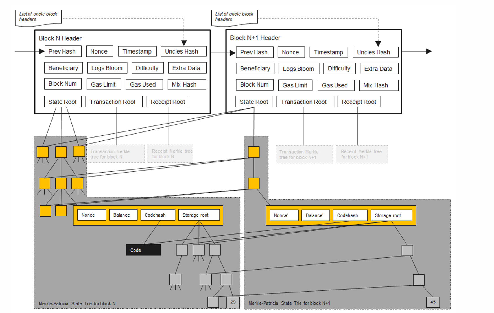
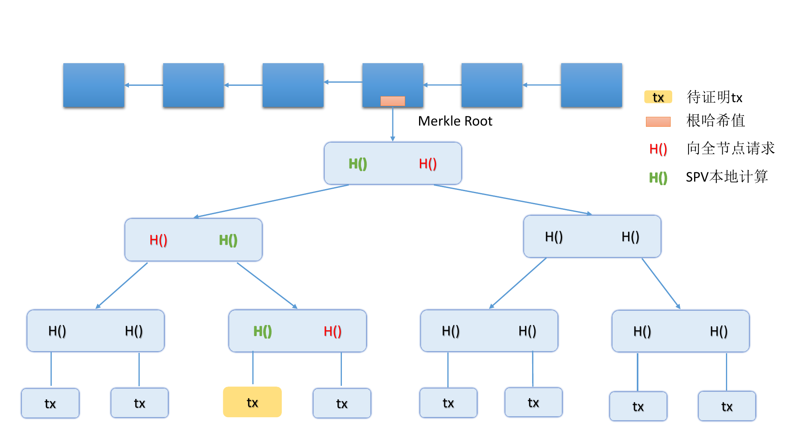
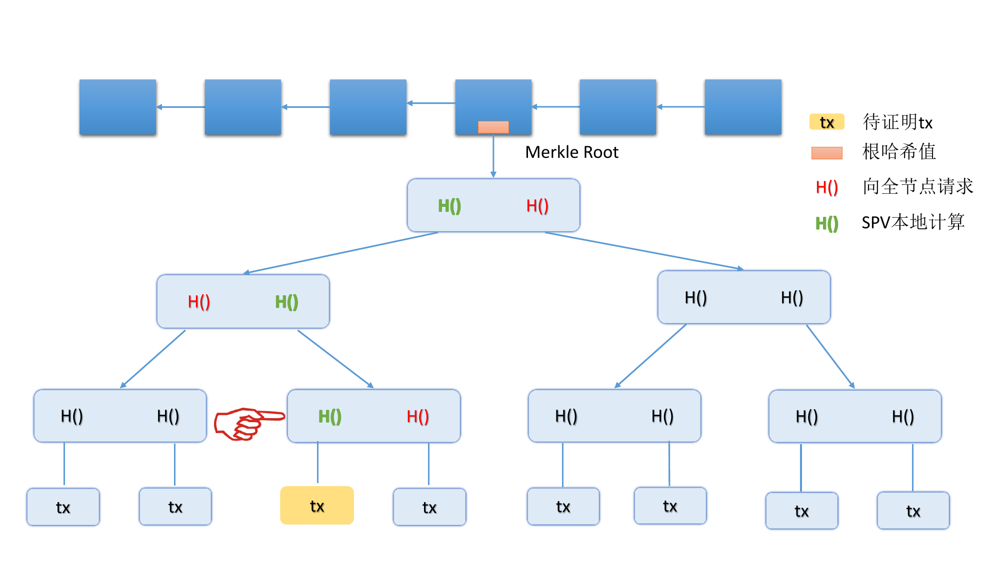
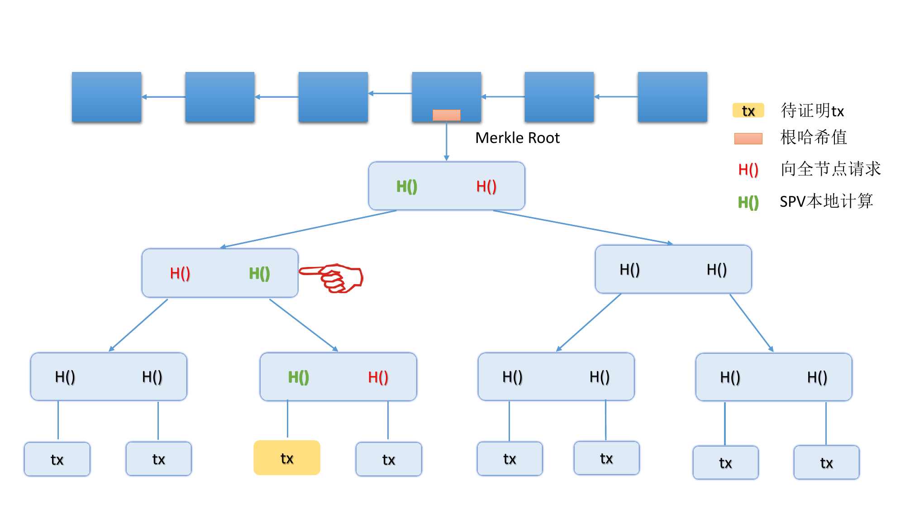
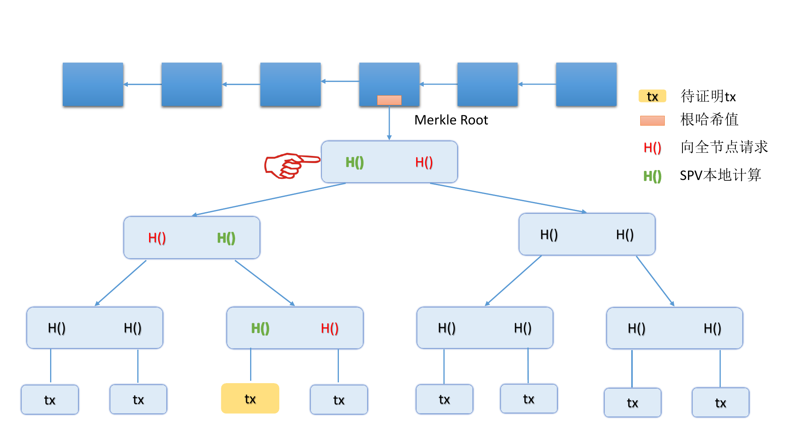
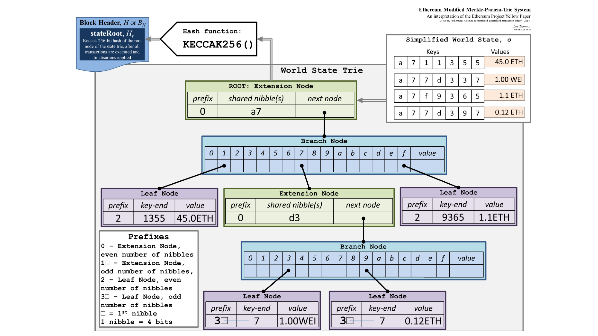
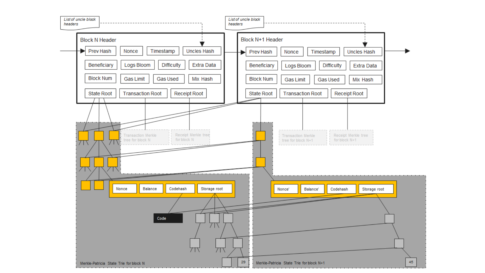

# 📚 Block Chain

此节笔记主要参考了 PKU 肖臻老师的《区块链技术与应用》公开课。

肖臻老师的homepage：[http://zhenxiao.com/](http://zhenxiao.com/)

公开课网址：[https://www.bilibili.com/video/av37065233/](https://www.bilibili.com/video/av37065233/)

---

## 什么是区块链？

区块链是一种去中心化、分布式且通常是公共的数字分类账，由称为区块的记录组成，这些区块用于记录交易信息到多台电脑上，以便任何涉及的区块都不能被追溯更改，否则会影响后续的区块。

从数据结构的角度看，区块链是一个单向链表，其中每个节点是一个区块而节点之间的指针采用 hash pointer。

每个区块都包含两个部分：block header 以及 block body。

block header 中主要维护了指向上一个区块的 block header 的 hash pointer，以及组织本区块数据的各种树的 root pointer。

block body 中主要保存了本区块的各种数据。BTC 链的 block body 保存了本区区块的交易记录，而 ETH 链的 block body 保存了本区块的用户状态、交易记录以及收据。


**ETH chain's block**

区块链这个数据结构本身被维护在一个 P2P 的网络中，该网络拓扑有两类节点：全节点和轻节点。
每个全节点保存区块链的一个完整副本，而每个轻节点只保存区块链所有 block header 的副本。当轻节点需要 block body 的信息是，它会请求全节点发送相应信息。

---

## 区块链如何保证不能被篡改？
这得益于 hash pointer。所谓的 hash pointer 只是一种形象的说法，实际上 block header里只有哈希值，没有指针。

那么怎么才能找到前一个区块的内容呢？全节点一般是把这些区块存储在一个 (key，value) 数据库里面。key 是区块的哈希，value就是区块的内容。一个常用的 key value 数据库是 level DB。所谓的区块链这种链表结构实际上是在 level DB 里面用哈希值算出来的。只要你掌握了最后一个区块的哈希值，那么你通过 level DB 的查找，哈希值 key 对应的 value 就可以把最后一个区块的内容取出来。然后这个区块块头里面，又有指向前一个区块的哈希值。那么再去查找 key 和 value，可以找到前一个区块的内容，以此类推，一步一步往前找，最终能够把整个区块链都找出来。

所以说在实际系统当中，所谓的哈希指针，只有哈希，没有指针，或者也可以认为哈希值的本身就是指针。

有一些节点没有保存完整的区块链的信息，只保存了最近的几千个区块，如果需要用到前面的区块的信息可以问其他的全节点要。哈希指针的性质保证了整个区块链的内容是不可篡改的。

在验证的时候，**节点会重新计算前一个区块的哈希值**，然后把重新算出来的真实哈希 hash_actual 和当前区块里声明的 previous_hash 对比。

你改了前一个区块，但后一个区块早就记着原来的哈希了，
而验证的时候，**用新的前区块内容重新算哈希 ➔ 新算出来的哈希值和后区块声明的值不一样 ➔ 对不上，验证失败。**

---

## 区块链的共识机制
**共识机制（Consensus Mechanism）**是指分布式系统如何就某一数据状态达成一致的协议。大多数需要对外展现出一致性的分布式系统都需要**共识机制（Consensus Mechanism）**或**共识算法（Consensus Algorithm）**l来达成这一目标。比如 raft 集群需要使得每个节点的 state machine 和 log 保持之一，这时候就需要共识机制来保证。

区块链中常用的共识机制称为 **Nakamoto 共识**。Nakamoto 共识是一种基于 PoW（工作量证明） 的共识机制，通过“算力竞争”和“最长链规则”让区块链网络中的节点逐步收敛到一条唯一的有效区块链。

Nakamoto 共识的核心要点有三个：

1. 工作量证明（PoW）

矿工通过计算大量哈希，寻找符合难度的区块哈希。首个找到有效哈希的矿工获得出块权，并获得区块奖励。

2. 最长链规则

节点总是认为包含最多累计工作量（最长的链）是“正确链”。如果网络出现分叉，节点会暂时接受分叉，但最终会选最长链。

3. 概率共识

由于网络延迟和随机因素，节点可能短暂产生分叉。随着时间推移，概率会越来越高达成一致（即区块被“确认”）。交易一般等待若干个区块后被视为最终确认（例如比特币通常等待6个区块确认）。

Nakamoto 共识具备一种“概率性拜占庭容错”特性，但严格来说它不是经典意义上的 BFT 协议。

BFT 指的是系统即使有一部分节点（最多不到三分之一）作恶或表现出任意错误行为，整个系统仍能保证安全和一致性。经典 BFT 协议（如 PBFT）通过节点间多轮投票，严格保证一致性和容错，通常适合小规模、许可链环境。

Nakamoto 共识基于 PoW，依赖算力多数原则，只要大多数算力（超过 50%）是诚实的，网络就能逐渐达成共识。它容忍恶意节点控制不到半数算力，能抵抗拜占庭故障（恶意作恶、双花攻击等）。但是，它不是通过传统投票达成一致，而是通过“最长链规则”和“概率最终性”来达成共识。

在 Nakamoto 共识中，交易的最终确认是概率性的，新区块可能会被临时分叉或重组，确认数越多，交易被篡改的概率越低，但永远不为零。与经典 BFT 协议中“确定性最终性”（一旦确认就不可更改）不同。因此，Nakamoto 共识提供概率安全保障而非确定安全。

共识机制使得只有可以提供 PoW 或者 PoS 的节点发布新区块。这是因为如果所有节点都能随意发布新区块，那么出现互斥交易时，整个系统不知道以哪一个为准，可能导致分布式系统一致性的丢失。PoW 或者 PoS 可以提供一种仲裁机制，表示一切以**享有权益的节点写入的信息为准。**

共识机制是分布式系统中一个核心而有趣的主题，这里也推荐读者了解一些其他分布式系统所用的共识机制：

| 共识算法                                       | 类型                   | 典型应用                         | 主要特点及说明                                 |
| ---------------------------------------------- | ---------------------- | -------------------------------- | ---------------------------------------------- |
| **Nakamoto 共识**                              | PoW (工作量证明)       | 比特币、以太坊1.0                | 算力竞争，最长链规则，概率最终性               |
| **PBFT (Practical Byzantine Fault Tolerance)** | BFT 投票机制           | Hyperledger Fabric、分布式数据库 | 多轮投票，确定性最终性，容忍 <1/3 恶意节点     |
| **Raft**                                       | 非拜占庭容错一致性协议 | etcd、Consul、RethinkDB          | 简单易理解，主要用于容错复制，不容忍拜占庭错误 |
| **Paxos**                                      | 非拜占庭容错一致性协议 | Google Chubby、Zookeeper         | 理论基础，复杂实现，保证一致性                 |
| **Tendermint**                                 | BFT + PoS              | Cosmos 生态链                    | 结合 PBFT 投票流程，快速确定性最终性           |
| **Algorand**                                   | BFT + PoS              | Algorand 公链                    | 随机抽样验证者，快速且安全                     |
| **Honey Badger BFT**                           | 异步 BFT               | 私链和公链研究                   | 异步容错，消息传递不依赖时间假设               |
| **Proof of Stake (PoS)**                       | 权益证明               | 以太坊2.0、Cardano、Polkadot     | 通过锁定代币参与共识，节能高效                 |
| **Delegated Proof of Stake (DPoS)**            | 权益证明变种           | EOS、Tron                        | 投票选出代表节点，提高效率                     |
| **Ripple Consensus Protocol**                  | 联邦共识               | Ripple                           | 联邦投票机制，低延迟，适合金融应用             |

---


## 挖矿
并非所有的节点都能向区块链上添加新的块，只有提供了 PoW 或 PoS 以此获得了**记账权**的节点有权向区块链添加新的区块。
而获得 PoW （往往伴随着 block reward）的方法称之为挖矿。

挖矿的逻辑是，miner 需要不断调整一个叫做 block header 中的 nonce 的参数，使得一个复杂的 hash function 对 block header 作用后的输出小于规定的 target 值。 在申请提交区块时，miner 将这个 nonce 参数写入 block header，维护区块链的节点会验证这个 nonce 是否使得 hash function 的输出小于 target。如果确实小于 target，发布这个区块。

由于尝试的 nonce 是随机的，所以**挖矿本身是无记忆的**。也就是说已经尝试的 nonce 数量，和找到一个小于 target 的哈希值的概率无关。

---

## 验证
验证包括工作量的验证：验证 block header 的哈希值是否小于 target，
以及交易合法性的验证：本地节点重新往 Merkel Tree 上写入一遍发布的交易，验证得到的 root hash 是否与发布区块的 root hash 匹配。

---

## Merkle Proof
Merkle Proof 是指在区块链中，轻节点用来验证交易合法性的证明机制。它是 SPV（Simplified Payment Verification） 的实现基础。

交易者向维护区块链的网络节点提交区块时需要证明将要写入区块的交易合法。在 BTC 中，交易者需要提供币的来源信息，在 ETH 中，交易者需要提供账号状态信息（账户余额信息）；这些信息或保存在 Merkle tree 中，或保存在 Modified Merkle Patricia Trie 中。当交易者要提交相应信息的节点时，实际上是提供了从 root 节点到相应叶子节点的链路上的所有 hash pointer。维护区块链的网络节点将给定的 hash pointer 与同节点中的 hash pointer 组合，自底向上计算出最终的实际根节点的 atul_hash 并和 block header 中维护的根节点 hash 对比。若两者相等，验证通过；反之不通过。

下面的展示的是一个轻节点进行 Merkle Proof 的过程。





**A Merkle Proof in Light Node**

---

## ETH

### ETH 的数据结构
ETH 的数据结构主要有两种：Block Chain 以及 Modified Merkle Patricia Trie。

这里主要讨论 Modified Merkle Patricia Trie。简单地讲，Modified Merkle Patricia Trie 是改良后的 Merkle Patricia Trie， 而 Merkle Patricia Trie 就是使用 hash pointer 的 Radix Tree。

不同于 BTC 只在 block body 中维护交易的内容，ETH 显式地在 block body 中维护账户状态，交易以及收据三种信息。这三种信息被组织成 Merkle Patricia Trie，其 root pointer 被维护在 block header 中。


**ETH Modified Merkle-Patricia-Trie System**

ETH 使用 Modified Merkle Patricia Trie 主要是基于需要修改用户状态的考虑。如果像 BTC 一样直接使用 Merkle Tree，每次修改一个账户状态，所有节点上的 Merkle Tree 必须重构，但不同的节点可能会构造出不同的 Merkle Tree，导致数据不一致。这会为 Merkle Proof 带来困难。

实际上，ETH 对账户的修改并非原地的，而是在新区块的 Modified Merkle Patricia Trie 写入更新后的分支，其他所有节点指向原来的地址。这是因为存在 roll back 的需求，并且这样做不需要把整棵树发布，降低了网络负担。


**Updating For Modified Merkle Patricia Trie**

ETH 区块内的交易记录与收据同样也被组织为 Modified Merkle Patricia Trie，它们的节点是一一对应的。

### Bloom Filter
Bloom Filter（布隆过滤器）是一种空间效率极高的概率型数据结构，用于快速判断一个元素是否“可能存在”于一个集合中。它常用于网络安全、区块链、数据库、搜索引擎等对性能要求高的场景。

它有如下特点：

- 能判断元素可能在集合中；
- 不能判断元素一定不在集合中；
- 有一定误判率（假阳性 false positive）；
- 不会有漏判（false negative）。

Bloom Filter 使用，一个位数组（bit array），初始全为 0 以及 k 个独立哈希函数（如果其中一个 hash function 导致两个元素的发生 Hash Collision，我们能有另一个 hash function 使得它们不发生碰撞，这降低了 false positive 的概率）。

插入元素：

- 将元素输入到 k 个哈希函数中，得到 k 个位置，把位数组的这 k 个位置全部设置为 1。

判断元素是否存在：

- 用同样的 k 个哈希函数处理这个元素，如果所有对应的位都是 1 → 元素可能存在（但可能是误判）；
- 如果任何一位是 0 → 元素一定不存在。

**在删除一个元素时不能把它对应的 bits 重新置 0：**

Bloom Filter 的每一位可能是多个元素通过哈希映射到的“共享位置”，比如元素 A 和 B 都把第 10 位设成了 1。如果你“删除”元素 A 并把第 10 位重置为 0，那元素 B 的存在信息也一起被抹掉了。

在比特币等区块链中，SPV（Simplified Payment Verification）轻节点并不保存整个区块链，只下载区块头和相关交易。这时，Bloom Filter 就发挥作用：SPV 客户端可以创建一个 Bloom Filter，表示“我关心的地址/公钥哈希/交易输出”等。然后将这个 Bloom Filter 发送给全节点。全节点使用该过滤器只发送那些可能匹配该轻节点关心的交易。


### GHOST
在区块链中，GHOST 机制（Greedy Heaviest-Observed Sub-Tree）是以太坊等链采用的一种改进的区块选择机制，旨在解决比特币原有最长链规则的效率问题，提高系统吞吐量和安全性。

在比特币中，矿工总是选择“最长链”来继续挖矿。一旦两个区块几乎同时被挖出来，就会临时产生“分叉”。最终只有一条链会被认为是有效的，另一条链上的区块会成为“孤块”（orphan block），被丢弃。这样的做的问题是浪费计算资源，导致很多 miner 的工作白费。

GHOST 机制的核心思想有两个：
- 第一，与其只考虑最长链，不如考虑包含更多“有效工作”的链。在选择主链时，不仅看“哪条链最长”，而是选“工作量最大的子树”。
- 第二，即使某些区块未直接在主链上，只要它们是诚实产生的，也会对主链选择产生影响。

以太坊在早期版本中（Ethash 共识，PoW）引入了 GHOST 的简化版本：允许被“丢弃”的分支中的合法区块部分获得奖励。一个主链区块可以引用最多 2 个其他链上的 uncle blocks。miner 挖到 uncle block 也能获得部分 ETH 奖励，并且越早地被引用，得到的奖励越多。这个机制能鼓励那些没有成为主链编写者的 miner 尽早合并到主链上，减小了 ETH 分叉的风险。

### ETH 的挖矿算法
为了防止 ASIC 芯片的滥用，ETH 设计了 Memory Hard Miner Puzzle（ASIC miner 的计算性能远高于普通个人电脑，但访存速度却没有这种优势）。其主要思想是让 miner 在运行 hash function 时需要维护一个大的数组，通过大量访存时间来稀释计算时间上的优势。

计算 ETH 的 hash 需要一个 16M 的 cache 数组以及一个 1G 的 DAG 数组（需要的 cache 和 DAG 的大小还会随着时间增长）。

cache 通过 cache[0] 位置上的 seed 元素不断往后进行 hash function 的递推生成。
$$
cache_0 = seed,
$$
$$
cache_n = hash(cache_{n-1})
$$

DAG 的每个位置由伪随机挑选的 256 个 cache 中的元素生成。最后，从 DAG 中挑选 128 个元素（和 nonce 相关）生成 hash function 的输出。

miner 挖矿时需维护 cache 和 DAG，而进行验证的轻节点只需要维护 cache，动态生成所需要的 DAG 元素。这样做的好处是使得 miner 有 memory hard 的同时，轻节点验证不出现此问题。

### ETH 的挖矿难度调整策略
ETH 进行挖矿难度的主要作用是稳定出块速度以及稳定货币供给量， 挖矿难度 $diff$ 与 miner puzzle 的 $target$ 负相关。每个区块的挖矿难度基于以下公式：

$$
D(H) \equiv 
\begin{cases}
D_0, & \text{if } H_i = 0 \\
\max\left( D_0, P(H)_{H_d} + x \times \zeta_2 \right) + \epsilon, & \text{otherwise}
\end{cases}
$$

$where：$

$$
D_0 \equiv 131072
$$

- $H_i$ 是本区块序号。
- $D(H)$ 是本区块的难度，由基础部分 $P(H)_{H_d} + x \times \zeta_2$ 和难度炸弹部分 $\epsilon$ 相加得到。
- $P(H)_{H_d}$ 是父区块的难度，每个区块的难度都是在父区块难度的基础上进行调整。
- $x \times \zeta_2$ 用于自适应调节出块难度，维持稳定的出块速度。
- $\epsilon$ 表示设定的难度炸弹，其作用是在一段时间后使得挖矿难度爆炸，迫使 PoW 向 PoS 转型。
- 基础部分有下界，为最小值 $D_0 = 131072$。

自适应难度调整 $x \times \zeta_2$:

$$
x \equiv \left\lfloor \frac{P(H)_{H_d}}{2048} \right\rfloor
\quad
$$

$$
\zeta_2 \equiv \max\left( y - \left\lfloor \frac{H_s - P(H)_{H_s}}{9} \right\rfloor, -99 \right)
\quad
$$

- $x$ 是调整的粒度，$\zeta_2$ 为调整的系数。
- $y$ 和父区块的 uncle 数有关。如果父区块中包括了 uncle，则 $y$ 为 2，否则为 1。
- 父块包含 uncle 时，难度会大一个单位，因为包含 uncle 时新发行的货币量大，需要适当提高难度以保持货币发行量稳定。
- 难度降低的上界设置为 $-99$，主要是应对被黑客攻击或其他目前想不到的黑天鹅事件。

$$
y - \left\lfloor \frac{H_S - P(H)_{H_S}}{9} \right\rfloor
$$

- $H_S$ 是本区块的时间戳，$P(H)_{H_S}$ 是父区块的时间戳，均以秒为单位，并规定 $H_S > P(H)_{H_S}$ 。$H_S - P(H)_{H_S}$ 就是出块时间。
  - 该部分是稳定出块速度的最重要部分：出块时间过短则调大难度，出块时间过长则调小难度。

- 以父块不带 uncle 的情况（$y=1$）为例：
  - 出块时间在 $[1,8]$ 之间，出块时间过短，难度调大一个单位。
  - 出块时间在 $[9,17]$ 之间，出块时间可以接受，难度保持不变。
  - 相差时间在 $[18,26]$ 之间，出块时间过长，难度调小一个单位。

难度炸弹 $\epsilon$:

$$\epsilon \equiv \left\lfloor 2^{\left\lfloor \frac{H_i'}{100000} \right\rfloor - 2} \right\rfloor $$

$$H_i' \equiv \max(H_i - 3,000,000)$$

- 每十万个区块扩大一倍，是 2 的指数函数，后期增长极快，因此被称为难度"炸弹"。
- 降低迁移到 PoS 协议时的分叉风险：当挖矿难度激增时，矿工有动力迁移至 PoS 协议。
- 由真实区块号 $H_i$ 减去 $300$ 万得到（即 $H_i' = \max(H_i - 3,000,000)$）。  
- 此设计源于低估 PoS 协议的开发难度，需延长约一年半的过渡期（通过 [EIP-100](https://eips.ethereum.org/EIPS/eip-100) 实现）。

### PoS
PoS 是 Proof-of-Stake 的缩写，是一种基于用户持有的代币数量来进行记账权分配的共识机制。基于 PoW 获得记账权广受诟病的一点是，需要大量的算力和能源，而这两者根本上是由资金大小决定的。因此，PoS 的一个核心想法是**直接通过资本金大小分配记账权**。

而 PoS 则是基于用户持有的代币数量来进行记账权分配，用户持有的代币数量越多，获得记账权的概率就越大。

这样做的第一个好处是降低了能源消耗，因为不需要大量的能源来维持挖矿的过程。同时，由于必须持有代币才能获得记账权，这使得在币种发行早期记账权被开发团队控制，也避免了 Altcoin Infanticide。

ETH 准备采用的 PoS 协议是 Casper，它和 PoW 混合使用，为经过 PoW 验证的区块提供记 finality。获得 finality 状态的区块会成为合法链的部分，即使有恶意攻击使得与之平行的更长分支出现。

在 Casper 协议中引入了 Validator 的概念，Validator 是指一些特殊的账户，它们可以行使投票权使得一个 epoch 获得 finality 状态。在 Casper 中，同一分支上的 50 个连续区块组成一个 epoch，每一轮投票作用于同一分支上的两个连续的 epoch。每次投票需要 2/3 的 Validator 同意才能通过；通过后，前一个 epoch 获得 commit message，后一个 epoch 获得 prepare message；只有获得 commit message 的 epoch 才能获得 finality。

约束 Validator 的行为利用了 Validator Reward 和保证金制度。当 Validator 行为良好时会得到 Reward，反之则销毁一部分的保证金。设计上没有硬性限制 Validator 不可以为多个平行分支投票，但是一旦被发现其保证金会被没收。

目前 PoS 协议还有许多需要解决的问题，PoW 仍然是主流。

### 智能合约
智能合约是保存在区块链中的代码，它定义了两个或者或者区块链账户的交易行为（如定义一个拍卖）。区块链上的账户分为两类：一类是**外部账户**，另一类是**合约账户**。合约用户可以看作一个为外部用户的交易服务的公正第三方；例如，一个定义了拍卖的合约，其合约账户可以看作拍卖行：对受益人来说，它是竞拍者的代理；对竞拍者来说，它是受益人的代理。在 ETH 的链上，智能合约用 Solidity 语言编写。对于同一输入，智能合约中的方法输出必须是不变的，故而**智能合约不支持并发/并行计算**。

以下是一个智能合约的例子：
```solidity
pragma solidity ^0.4.21;

contract SimpleAuction {
    address public beneficiary; // 拍卖受益人
    uint public auctionEnd;     // 结束时间

    address public highestBidder; // 当前的最高出价人
    mapping(address => uint) bids; // 所有竞拍者的出价
    address[] bidders;             // 所有竞拍者

    /// 需要记录的事件
    event HighestBidIncreased(address bidder, uint amount);
    event Pay2Beneficiary(address winner, uint amount);

    /// 以受益者地址 `_beneficiary` 的名义，
    /// 创建一个简单的拍卖，拍卖时间为 `_biddingTime` 秒。
    constructor(uint _biddingTime, address _beneficiary) public {
        beneficiary = _beneficiary;
        auctionEnd = now + _biddingTime;
    }

    /// 对拍卖进行出价，随交易一起发送的ether与之前已经发送的
    /// ether的和为本次出价。
    function bid() public payable {
        ...
    }

    /// 使用withdraw模式
    /// 由投标者自己取回出价，返回是否成功
    function withdraw() public returns (bool) {
        ...
    }

    /// 结束拍卖，把最高的出价发送给受益人
    function pay2Beneficiary() public returns (bool) {
        ...
    }
}
```
一个用户若向出价，必须通过他的外部账户调用合约中的 `bid()` 方法。调用方法是创建一个交易，接收地址为要调用的那个智能合约的地址，data 域填写要调用的函数以及其参数的编码值。

合约账户之间也可以相互调用，有直接调用，调用 `address.call()`, 代理调用 `delegatecall()` 三种方法。 

1. 直接调用：
```solidity
contract A {
    event LogCallFoo(string str);

    function foo(string str) returns (uint) {
        emit LogCallFoo(str);
        return 123;
    }
}

contract B {
    uint ua;

    function callAFooDirectly(address addr) public {
        A a = A(addr);
        ua = a.foo("call foo directly");
    }
}
```

- 如果在执行 `a.foo()` 过程中抛出错误，则 `callAFooDirectly()` 也抛出错误，本次调用全部回滚。
- `ua` 为执行 `a.foo("call foo directly")` 的返回值。
- 可以通过 `.gas()` 和 `.value()` 调整提供的 gas 数量或提供一些 ETH。

2.调用 `address.call()`：

```solidity
contract C {
    function callAfooByCall(address addr) public returns (bool) {
        bytes4 funcsig = bytes4(keccak256("foo(string"));
        if (addr.call(funcsig, "call foo by func call"))
            return true;
        return false;
    }
}
```

- 第一个参数被编码成4个字节，表示要调用的函数的签名。  
- 其它参数会被扩展到32字节，表示要调用函数的参数。  
- 上面的这个例子相当于 `A(addr).foo("call foo by func call")`。  
- 返回一个布尔值，表明被调用的函数已经执行完毕（`true`）或者引发了一个EVM异常（`false`），无法获取函数返回值。  
- 也可以通过 `.gas()` 和 `.value()` 调整提供的 gas 数量或提供一些 ETH。


3.代理调用 `delegatecall()`：

- 使用方法与 `call()` 相同，只是**不能使用 `.value()`**。  
- **区别在于是否切换上下文**：  
  - `call()` 切换到被调用的智能合约上下文中（包括存储、余额等属性）。  
  - `delegatecall()` 只使用给定地址的**代码**，其他属性（存储、余额等）均取自当前合约。  
  - 目的是复用其他合约的库代码，例如：通过 `delegatecall` 调用库合约中的函数，但操作当前合约的存储状态。

定义智能合约时，有一类特殊的函数 `fallback()`。

```solidity
function() public [payable] {
    ......
}

```
这是一个匿名函数，没有参数也没有返回值。在以下两种情况下会被调用：
- 直接向合约地址转账且不包含任何data。
- 调用的函数在合约中不存在。

如果转账金额不为零，必须声明为 payable，否则会抛出异常。

接受转账的合约如果没有定义 `fallback()` 函数，会抛出异常。这一点可以被黑客利用，造成**灾难性的后果**，我们下面可以看到。
  
创建一个智能合约需要外部账户发起一个转账交易到 `0x0` 地址, 转账金额为 `0`，但需支付汽油费（gas），合约代码存放在交易的 `data` 域中。

智能合约运行在 EVM（Ethereum Virtual Machine）上。这是为了保证智能合约可以跨平台运行。

### gas fee
执行合约中的每条指令均需支付汽油费，费用由交易发起者承担。gas fee 的获益人是将这个区块挖出的 miner（只有这一个 miner 可以获得汽油费），因为执行这些指令消耗的是这个 miner 拥有的算力。

交易数据结构（txdata struct）：
```go
type txdata struct {
    AccountNonce uint64          `json:"nonce"     gencodec:"required"`  
    Price        *big.Int        `json:"gasPrice"  gencodec:"required"`  
    GasLimit     uint64          `json:"gas"       gencodec:"required"`  
    Recipient    *common.Address `json:"to"        rlp:"nil"`  // nil表示合约创建  
    Amount       *big.Int        `json:"value"     gencodec:"required"`  
    Payload      []byte          `json:"input"     gencodec:"required"`  
}
```
EVM中不同指令的汽油费消耗差异：

- 简单指令（如算术运算）消耗汽油费较低。
- 复杂指令（如存储状态修改）消耗汽油费较高。
- 设计合约时需优化代码，避免高成本操作以降低汽油费开销。

**设计 gas fee 是为了防止恶意调用合约中的方法，浪费计算资源。**gas fee 策略的失败导致了 ETH 维护团队在 The DAO 事件中的软分叉策略失效，我们之后将会看到。

智能合约中不存在自定义的 try-catch 结构，一旦遇到未捕获的异常，本次所有操作将完全回滚（除非使用 call 等低级函数）。

错误抛出方式：`assert(bool condition)`，用于检测内部错误（例如不变量违反）；`require(bool condition, string message)`用于验证输入或外部条件（如函数前置条件；`revert(string message)`，直接终止执行并回滚状态，可自定义错误信息。

嵌套调用的回滚，如合约 A 调用合约 B 的函数（如通过 call/delegatecall）：

- 若使用高层级调用（如直接调用 B.foo()），被调用合约 B 的异常会触发合约 A 的完全回滚。

- 若使用底层调用（如 B.call(abi.encodeWithSignature("foo()"))），异常仅返回 false，合约 A 的状态修改可能保留。

一个合约直接向一个合约帐户里转账，没有指明调用哪个函数，仍然会引起嵌套调用（`fallback()`函数）。

智能合约运行在区块环境中，它只能获得区块提供的环境变量。

### 先执行交易还是先挖矿？
挖矿需要当前 block header 的信息，这其中包括 ETH 的 block 中维护的状态树、交易树和收据树的根节点 hash。这些根节点 hash 需要先执行当前区块中的交易，才能够得到。所以是先交易，再挖矿。

有人可能会说这样可能会导致逻辑冲突的交易同时进行，但是**只有发布的区块上的交易才是被认可的共识**。当另一个节点发布与本地节点的交易冲突时，本地节点抛弃正在挖矿的这个区块。

### 调用失败还要写入区块链吗？
会。若在调用过程中发生异常，本次调用会 roll back 。但 gas fee 是一定要交的，至少要在区块里面写入 gas fee 的信息。

### 如何保证所有节点都愿意在本地验证发布的区块是否有效？
在其他节点发布一个新区块时，本地节点验证新区块的工作量是需要计算资源的。而且拥有本地节点的 miner 也得不到验证的 gas fee。为什么他们还是愿意验证这些交易而不是直接写入本地区块链呢？

这和 root hash 的验证有关系。假设这个 miner 不验证就直接把这个区块添加到区块链上，如果这个区块中的交易的不合法的，那么这个 miner 所拥有节点上记录的三棵 Merkel Tree 的 root hash 就和其他老实验证 miner 所拥有的节点上记录的 root hash 分道扬镳了。如果不出意外，**那么这个不老实的 miner 所发布的区块就永远通不过验证了。** 

### Code is Law
写入区块链的智能合约不可修改，即使这个智能合约存在验证逻辑漏洞。所以在写入区块链前，必须先对智能合约进行严格的调试。

这里给出一些智能合约出现逻辑漏洞的例子。我们从一个简单的拍卖开始：

```solidity
pragma solidity ^0.4.21

contract SimpleAuctionV1{
    address public beneficiary;     // 拍卖受益人
    uint public auctionEnd;         // 结束时间
    address public highestBidder;   // 当前的最高出价人
    mapping(address => unit) bids;  // 所有竞拍者的出价
    address[] bidders;              // 所有竞拍者
    bool ended;                     // 拍卖结束后设为 true

    // 需要记录的事件
    event HighestBidIncreased(address bidder, unit amount);
    event AuctionEnded(address winner, unit amount);

    // 以受益人地址 `_beneficiary` 的名义，
    // 创建一个简单的拍卖，拍卖时间为 `_biddingTime` 秒。
    // 这是一个拍卖实例的构造函数
    constructor(unit _biddingTime, address _beneficiary) public {
        beneficiary = _beneficiary;
        auctionEnd = now  + _biddingTime;
    }

    // 对拍卖出价
    // 随交易一起发送的 ether 与之前已经发送的 ether 的和为本次出价
    function bid() public payable {
        // 对于能接收 ether 的函数，关键字 payable 是必须的。

        // 执行条件：拍卖未结束
        require(now <= auctionEnd);
        // 如果出价不够高，本次出价无效，直接返回报错
        require(bids[msg.sender] + msg.value > bids[highestBidder]);

        // 如果此人之前未出价，则加入竞拍者列表
        if(!bids[msg.sender] == uint(0)) {
            bidder.push(msg.sender);
        }

        // 本次出价是当前最高出价，更新最高出价
        highestBidder = msg.sender;
        bids[msg.sender] += msg.value;
        emit HighestBidIncreased(msg.sender, bids[msg.sender]);
    }

    // 结束拍卖，把最高的出价发送给受益人， 
    // 并把未中标的出价者的钱返还
    function auctionEnd() public {
        // 执行条件，拍卖已经截止
        require(now > auctionEnd);
        // 执行条件，该函数未被调用过
        require(!ended);

        // 把最高出价发送给受益人
        beneficiary.transfer(bid[highestBidder]);
        for (uint i = 0; i < bidders.length; i ++) {
            address bidder = bidder[i];
            if (bidder == highestBidder) continue;
            bidder.transfer(bids[bidder]);
        }
    } 
}
```
这个合约有一个问题，所有未中标的出价者的钱返还都写在函数 `auctionEnd()` 中。假设某个出价账户是一个合约账户，我们提到过，它作为 `bidder.transfer(bids[bidder])` 的接收者必须定义 `fallback()` 函数，不然会发生异常。
如果就有一个这样的账户，那么 `auctionEnd()` 函数执行到此处时会将整个函数 roll back，**所有人的钱都取不出了！**
**而且合约的规则是不可更改的，我们对此无能为力。**

我们将返还未中标者的钱的逻辑分离，由竞拍者自己调用相应的函数：

```solidity
pragma solidity ^0.4.21

contract SimpleAuctionV2{
  .
  .
  .

  // 使用 withdraw 模式，
  // 由投标者自己取回出价，返回是否成功
  function withdraw() public return (bool) {
    // 执行条件：拍卖已截止
    require(now > auctionEnd);
    // 竞拍成功者需要把钱给受益人，不可取回出价
    require(msg.sender != highestBidder);
    // 需要这个地址有钱可取
    require(bids[msg.sender] > 0);

    uint amount = bids[msg.sender];
    if (msg.sender.call.value(amount)()) {
        bids[msg.sender] = 0;
        return true;
    }

    return false;
  }

  event Pay2Beneficiary(address winner, uint amount);
  // 拍卖结束，把最高出价发送给受益人
  function pay2Beneficiary() public return (bool) {
    // 执行条件：拍卖已截止
    require(now > auctionEnd);
    // 需要这个地址有钱可取
    require(bids[highestBidder] > 0);

    uint amount = bids[highestBidder];
    bids[highestBidder] = 0;
    emit Pay2Beneficiary(highestBidder, amount);

    if (!beneficiary.call.value(amount)()) {
        bids[highestBidder] = amount;
        return false;
    }

    return true;
  }
}
```

但这个修改后的方案仍然存在巨大的错误，因为它无法抵抗重入攻击（Re-entrancy Attack）。当合约账户收到 ETH 但未调用函数时，会立即执行 `fallback()` 函数，`addr.send()` 、`addr.transfer()`、`addr.call.value()()` 三种支付方式都会导致收款账户上的 `fallback()` 函数被调用，而这个 `fallback()` 函数是用户自己定义的。

在上面的例子中，如果这个用户在自己的 `fallback()` 函数中再次调用合约的 `withdraw()` 函数，由于改变合约记录的语句 `bids[msg.sender] = 0;` 写在实际支付的语句 `msg.sender.call.value(amount)()` 之后，所以 `fallback()` 函数中对 `withdraw()` 函数的任何一次调用都会通过 `require(bids[msg.sender] > 0);` 的检查。**收款方将会不断地受到来自合约账户的转账直到函数调用栈溢出或合约账户的余额被耗尽。**这种攻击手段就是 Re-entrancy Attack。

为了避免这类攻击，在编写智能合约时我们必须遵循一个原则，即**内存中记录的修改必须发生在实际交易前**：

```solidity
pragma solidity ^0.4.21

contract SimpleAuctionV3{
  .
  .
  .

  // 使用 withdraw 模式，
  // 由投标者自己取回出价，返回是否成功
  function withdraw() public return (bool) {
    // 执行条件：拍卖已截止
    require(now > auctionEnd);
    // 竞拍成功者需要把钱给受益人，不可取回出价
    require(msg.sender != highestBidder);
    // 需要这个地址有钱可取
    require(bids[msg.sender] > 0);

    uint amount = bids[msg.sender];
    bids[msg.sender] = 0;
    if (msg.sender.call.value(amount)()) {
        return true;
    }

    bids[msg.sender] = amount;
    return false;
  }

  .
  .
  .
}
```

### The DAO 事件
对 The DAO 合约的 Re-entrancy Attack 导致了 The DAO 的合约账户上价值 5000 万美元的 ETH 落入黑客手中，并最终使得 ETH 分裂成平行的 ETC 与 ETH 两条链。导致 The DAO 事件的主要原因是智能合约的编写失误，ETH 维护团队的在事件后立即提出了软分叉策略：所有节点增加一条判断逻辑，不允许使用和 The DAO 相关的 ETH 进行交易。但他们并没有为这些判断指定额外的 gas fee，这导致了大量矿工遭遇了 DoS 攻击，最后 ETH 维护团队不得不采取硬分叉策略。

wiki 链接：[https://en.wikipedia.org/wiki/The_DAO_(organization)](https://en.wikipedia.org/wiki/The_DAO_(organization))

技术分析：[https://blog.chain.link/reentrancy-attacks-and-the-dao-hack/](https://blog.chain.link/reentrancy-attacks-and-the-dao-hack/)


### Beauty Chain 事件
Beauty Chain 事件是 hacker 利用类型溢出导致的货币超发，导致 Beauty Chain 的代币市值暴跌。

技术分析：[https://learnblockchain.cn/2018/04/25/bec-overflow](https://learnblockchain.cn/2018/04/25/bec-overflow)


