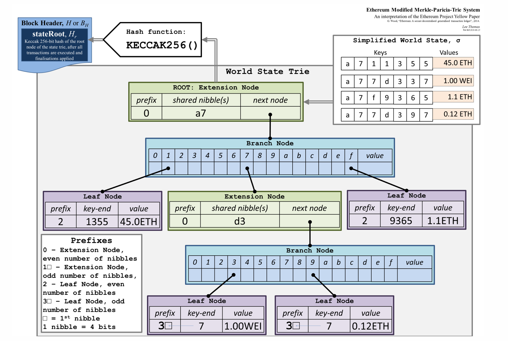

# 📚 Block Chain

---

## 什么是区块链？

区块链是一种去中心化、分布式且通常是公共的数字分类账，由称为区块的记录组成，这些区块用于记录交易信息到多台电脑上，以便任何涉及的区块都不能被追溯更改，否则会影响后续的区块。

从数据结构的角度看，区块链是一个单向链表，其中每个节点是一个区块而节点之间的指针采用 hash pointer。

每个区块都包含两个部分：block header 以及 block body。

block header 中主要维护了指向上一个区块的 block header 的 hash pointer，以及组织本区块数据的各种树的 root pointer。

block body 中主要保存了本区块的各种数据。BTC 链的 block body 保存了本区区块的交易记录，而 ETH 链的 block body 保存了本区块的用户状态、交易记录以及收据。

**ETH chain's block**

区块链这个数据结构本身被维护在一个 P2P 的网络中，该网络拓扑有两类节点：全节点和轻节点。
每个全节点保存区块链的一个完整副本，而每个轻节点只保存区块链所有 block header 的副本。当轻节点需要 block body 的信息是，它会请求全节点发送相应信息。

---

## 区块链如何保证不能被篡改？
这得益于 hash pointer。所谓的 hash pointer 只是一种形象的说法，实际上 block header里只有哈希值，没有指针。

那么怎么才能找到前一个区块的内容呢？全节点一般是把这些区块存储在一个 (key，value) 数据库里面。key 是区块的哈希，value就是区块的内容。一个常用的 key value 数据库是 level DB。所谓的区块链这种链表结构实际上是在 level DB 里面用哈希值算出来的。只要你掌握了最后一个区块的哈希值，那么你通过 level DB 的查找，哈希值 key 对应的 value 就可以把最后一个区块的内容取出来。然后这个区块块头里面，又有指向前一个区块的哈希值。那么再去查找 key 和 value，可以找到前一个区块的内容，以此类推，一步一步往前找，最终能够把整个区块链都找出来。

所以说在实际系统当中，所谓的哈希指针，只有哈希，没有指针，或者也可以认为哈希值的本身就是指针。

有一些节点没有保存完整的区块链的信息，只保存了最近的几千个区块，如果需要用到前面的区块的信息可以问其他的全节点要。哈希指针的性质保证了整个区块链的内容是不可篡改的。

在验证的时候，**节点会重新计算前一个区块的哈希值**，然后把重新算出来的真实哈希 hash_actual 和当前区块里声明的 previous_hash 对比。

你改了前一个区块，但后一个区块早就记着原来的哈希了，
而验证的时候，**用新的前区块内容重新算哈希 ➔ 新算出来的哈希值和后区块声明的值不一样 ➔ 对不上，验证失败。**

---

## 挖矿
并非所有的用户都能向区块链上添加新的块，只有提供了 PoW 或 PoS 以此获得了**记账权**的用户有权向区块链添加新的区块。
而获得 PoW （往往伴随着 block reward）的方法称之为挖矿。

挖矿的逻辑是，miner 需要不断调整一个叫做 nonce 的参数，使得一个复杂的 hash function 的输出小于规定的 target 值。 在申请提交区块时，miner 将这个 nonce 参数写入 block header，维护区块链的节点会验证这个 nonce 是否使得 hash function 的输出小于 target。如果确实小于 target，发布这个区块。

---

## Merkle Proof

---

## ETH

### ETH 的数据结构
ETH 的数据结构主要有两种：Block Chain 以及 Modified Merkle Patricia Trie。

这里主要讨论 Modified Merkle Patricia Trie。简单地讲，Modified Merkle Patricia Trie 是改良后的 Merkle Patricia Trie， 而 Merkle Patricia Trie 就是使用 hash pointer 的 Radix Tree。

不同于 BTC 只在 block body 中维护交易的内容，ETH 显式地在 block body 中维护账户状态，交易以及收据三种信息。这三种信息被组织成 Merkle Patricia Trie，其 root pointer 被维护在 block header 中。

**ETH Modified Merkle-Patricia-Trie System**

ETH 使用 Modified Merkle Patricia Trie 主要是基于需要修改用户状态的考虑。如果像 BTC 一样直接使用 Merkle Tree，每次修改一个账户状态，所有节点上的 Merkle Tree 必须重构，但不同的节点可能会构造出不同的 Merkle Tree，导致数据不一致。这会为 Merkle Proof 带来困难。

实际上，ETH 对账户的修改并非原地的，而是在新区块的 Modified Merkle Patricia Trie 写入更新后的分支，其他所有节点指向原来的地址。这是因为存在 roll back 的需求。

**Updating For Modified Merkle Patricia Trie**

ETH 区块内的交易记录与收据同样也被组织为 Modified Merkle Patricia Trie，它们的节点是一一对应的。

### Bloom Filter

### GHOST

### ETH 的挖矿算法
为了防止 ASIC 芯片的滥用，ETH 设计了 Memory Hard Miner Puzzle（ASIC miner 的计算性能远高于普通个人电脑，但访存速度却没有这种优势）。其主要思想是让 miner 在运行 hash function 时需要维护一个大的数组，通过大量访存时间来稀释计算时间上的优势。

计算 ETH 的 hash 需要一个 16M 的 cache 数组以及一个 1G 的 DAG 数组（需要的 cache 和 DAG 的大小还会随着时间增长）。

cache 通过 cache[0] 位置上的 seed 元素不断往后进行 hash function 的递推生成。
$$
cache_0 = seed,
$$
$$
cache_n = hash(cache_{n-1})
$$

DAG 的每个位置由伪随机挑选的 256 个 cache 中的元素生成。最后，从 DAG 中挑选 128 个元素（和 nonce 相关）生成 hash function 的输出。

miner 挖矿时需维护 cache 和 DAG，而进行验证的轻节点只需要维护 cache，动态生成所需要的 DAG 元素。这样做的好处是使得 miner 有 memory hard 的同时，轻节点验证不出现此问题。

### ETH 的挖矿难度调整策略

行内公式示例：$ a^2 + b^2 = c^2 $

块级公式示例：

$$
\sum_{i=1}^n i = \frac{n(n+1)}{2}
$$

